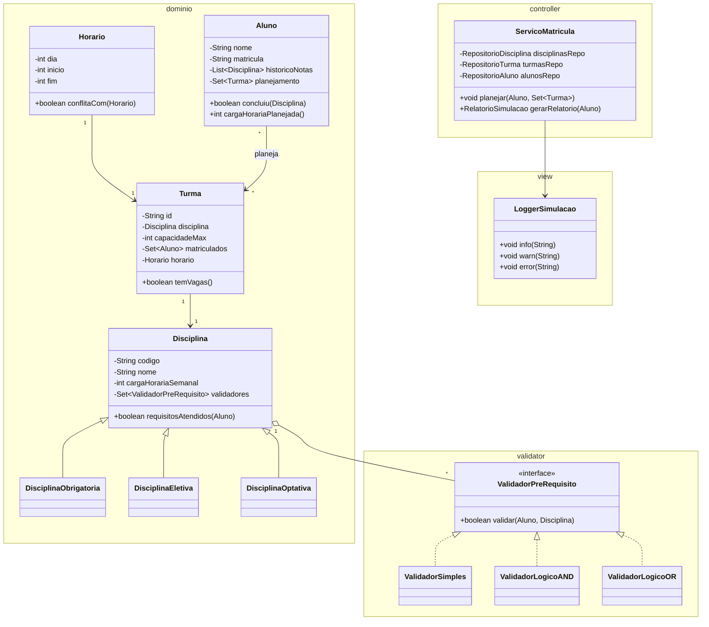

# Sistema-de-Simulacao-de-Planejamento-Acad-mico-POO
Sistema de Simulação de Planejamento Acadêmico Orientado a Objetos

Padrão de projeto MVC

Estrutura de pastas e arquivos:
```
simulador-planejamento-academico/
 ├─ build.gradle   (ou pom.xml)
 ├─ src/
 │  ├─ main/
 │  │   └─ java/
 │  │       └─ com.simulador/
 │  │            ├─ model/
 │  │            │    ├─ domain/
 │  │            │    │    ├─ Disciplina.java
 │  │            │    │    ├─ DisciplinaObrigatoria.java
 │  │            │    │    ├─ DisciplinaEletiva.java
 │  │            │    │    ├─ DisciplinaOptativa.java
 │  │            │    │    ├─ Turma.java
 │  │            │    │    ├─ Aluno.java
 │  │            │    │    └─ Horario.java
 │  │            │    │
 │  │            │    └─ validator/
 │  │            │         ├─ ValidadorPreRequisito.java
 │  │            │         ├─ ValidadorSimples.java
 │  │            │         ├─ ValidadorLogicoAND.java
 │  │            │         ├─ ValidadorCreditosMinimos.java
 │  │            │         └─ ValidadorLogicoOR.java
 │  │            │
 │  │            ├─ services/   # Usar para dividir a função principal em blocos menores
 │  │            │    ├─ VerifyDependencies.java
 │  │            │
 │  │            └─ controller/ # Entrada do programa
 │  │                 └─ ServicoMatricula.java
 │  │    
 │  └─ test/
 │       └─ java/
 │            └─ simulador/
 │                 ├─ resources/
 │                 │    ├─ Subjects.java
 │                 │    ├─ ClassGroup.java
 │                 │    └─ Students.java
 │                 ├─ validator/…
 │                 ├─ service/…
 │                 └─ domain/…
 │        
 └─ README.md
```

## Como Executar o Sistema

### Pré-requisitos
- Java 21 ou superior
- Maven 3.6 ou superior

### Compilação
```bash
mvn compile
```

### Execução
```bash
java -cp target/classes com.simulador.Main
```

## Menu de Opções

Após executar, o sistema mostrará um menu interativo com 7 opções:

1. **Ver relatório do aluno** - Relatório completo do aluno João Silva
2. **Listar disciplinas disponíveis** - Todas as disciplinas do sistema
3. **Listar turmas disponíveis** - Turmas com horários e capacidades
4. **Verificar elegibilidade** - Testa se aluno pode cursar disciplina
5. **Tentar matrícula** - Processa matrícula em turmas
6. **Ver histórico** - Disciplinas cursadas e planejamento
7. **Executar testes automáticos** - Roda cenários de teste
0. **Sair** - Sai do sistema

## 🎯 Casos Específicos Importantes

### ✅ Sistema de Pré-requisitos
- **ValidadorSimples**: Pré-requisito único (nota >= 6.0)
- **ValidadorLogicoAND**: Múltiplos pré-requisitos (todos obrigatórios)
- **ValidadorLogicoOR**: Múltiplos pré-requisitos (pelo menos um)
- **ValidadorCreditosMinimos**: Exige créditos mínimos acumulados

### ✅ Resolução de Conflitos
**Precedência**: Obrigatória > Eletiva > Optativa

Quando há conflito de horário entre disciplinas, o sistema escolhe baseado na precedência:
- **Obrigatória** sempre vence sobre Eletiva e Optativa
- **Eletiva** sempre vence sobre Optativa
- **Mesma precedência** = exceção (não resolve automaticamente)

### ✅ Controle de Créditos
- **1 hora semanal = 1 crédito** (4h = 4 créditos)
- **Apenas disciplinas aprovadas** (nota >= 6.0) contam para créditos
- **Disciplinas com créditos mínimos**:
  - Metodologia Científica (DCC123): 34 créditos
  - Monografia Final (DCC124): 34 créditos

### ✅ Co-requisitos
Disciplinas que devem ser cursadas **simultaneamente**:
- Adicionadas ao planejamento futuro
- Validadas automaticamente
- Exceção se não atendidos

## 📝 Disciplinas Específicas

### Eletiva (DCC197)
- **VISÃO COMPUTACIONAL**
- 4 horas semanais = 4 créditos

### Optativa (D133)
- **introducao a sistemas de informação**
- 2 horas semanais = 2 créditos

## 🧪 Testes

```bash
# Compilar
mvn compile

# Executar
java -cp target/classes com.simulador.Main


```

Diagrama de classes do projeto:
[Diagrama online no mermaid](https://www.mermaidchart.com/app/projects/a4e50a87-5301-4d4a-b4f5-64624b5565c8/diagrams/9d2acef6-a724-4817-81fc-8f849d2f6147/version/v0.1/edit)


