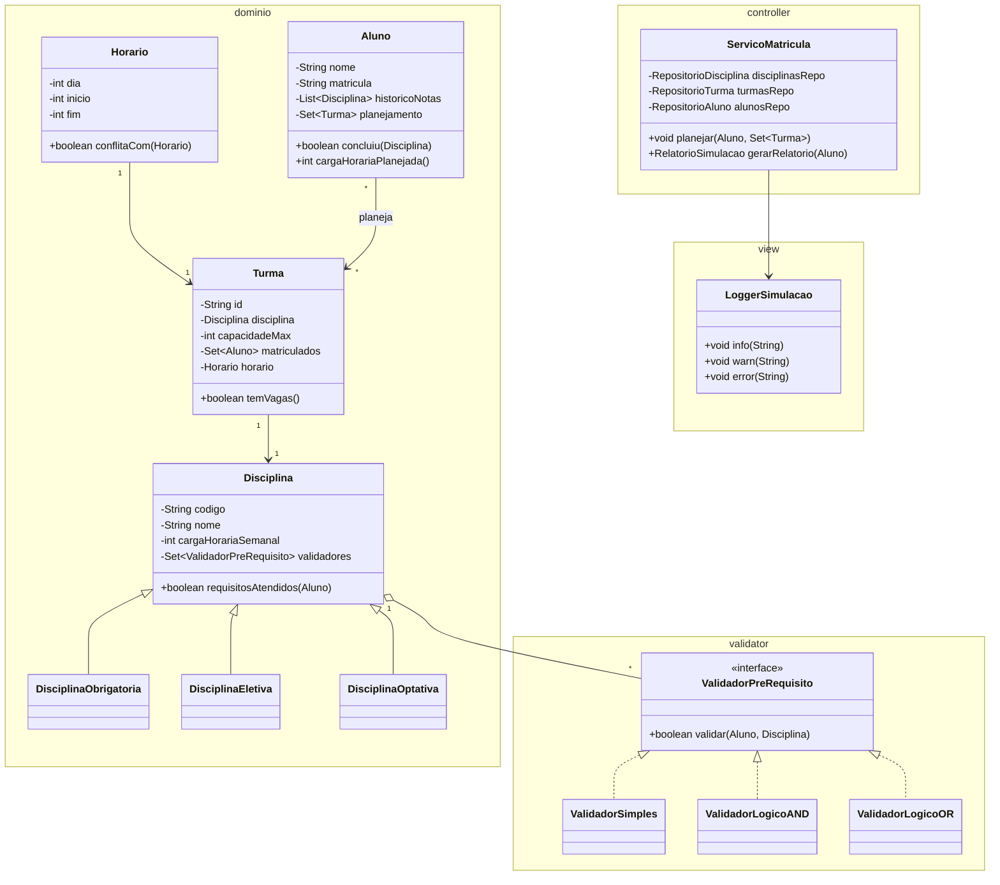

# Sistema-de-Simulacao-de-Planejamento-Acad-mico-POO
Sistema de Simulação de Planejamento Acadêmico Orientado a Objetos

Padrão de projeto MVC

Estrutura de pastas e arquivos:
```
simulador-planejamento-academico/
 ├─ build.gradle   (ou pom.xml)
 ├─ src/
 │  ├─ main/
 │  │   └─ java/
 │  │       └─ com.simulador/
 │  │            ├─ model/
 │  │            │    ├─ domain/
 │  │            │    │    ├─ Disciplina.java
 │  │            │    │    ├─ DisciplinaObrigatoria.java
 │  │            │    │    ├─ DisciplinaEletiva.java
 │  │            │    │    ├─ DisciplinaOptativa.java
 │  │            │    │    ├─ Turma.java
 │  │            │    │    ├─ Aluno.java
 │  │            │    │    └─ Horario.java
 │  │            │    │
 │  │            │    └─ validator/
 │  │            │         ├─ ValidadorPreRequisito.java
 │  │            │         ├─ ValidadorSimples.java
 │  │            │         ├─ ValidadorLogicoAND.java
 │  │            │         └─ ValidadorLogicoOR.java
 │  │            │
 │  │            ├─ services/   # Usar para dividir a função principal em blocos menores
 │  │            │    ├─ VerifyDependencies.java
 │  │            │
 │  │            └─ controller/ # Entrada do programa
 │  │                 └─ ServicoMatricula.java
 │  │    
 │  └─ test/
 │       └─ java/
 │            └─ simulador/
 │                 ├─ resources/
 │                 │    ├─ Subjects.java
 │                 │    ├─ ClassGroup.java
 │                 │    └─ Students.java
 │                 ├─ validator/…
 │                 ├─ service/…
 │                 └─ domain/…
 │        
 └─ README.md
```

Diagrama de classes do projeto:
[Diagrama online no mermaid](https://www.mermaidchart.com/app/projects/a4e50a87-5301-4d4a-b4f5-64624b5565c8/diagrams/9d2acef6-a724-4817-81fc-8f849d2f6147/version/v0.1/edit)


