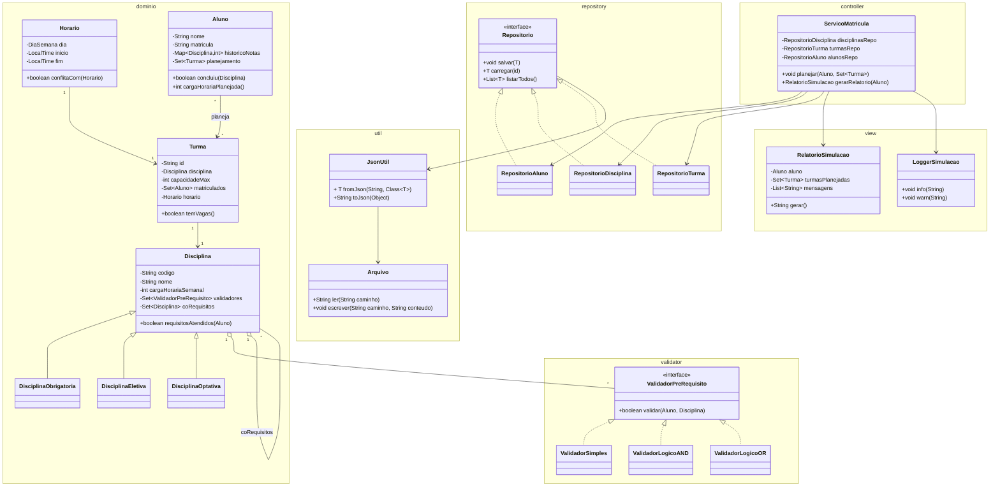

# Sistema-de-Simulacao-de-Planejamento-Acad-mico-POO
Sistema de Simulação de Planejamento Acadêmico Orientado a Objetos

Padrão de projeto MVC

Estrutura de pastas e arquivos:
```
simulador-planejamento-academico/
 ├─ build.gradle   (ou pom.xml)
 ├─ src/
 │  ├─ main/
 │  │   └─ java/
 │  │       └─ simulador/
 │  │            ├─ model/
 │  │            │    ├─ domain/
 │  │            │    │    ├─ Disciplina.java
 │  │            │    │    ├─ DisciplinaObrigatoria.java
 │  │            │    │    ├─ DisciplinaEletiva.java
 │  │            │    │    ├─ DisciplinaOptativa.java
 │  │            │    │    ├─ Turma.java
 │  │            │    │    ├─ Aluno.java
 │  │            │    │    ├─ Horario.java
 │  │            │    │  
 │  │            │    ├─ validator/
 │  │            │    │    ├─ ValidadorPreRequisito.java
 │  │            │    │    ├─ ValidadorSimples.java
 │  │            │    │    ├─ ValidadorLogicoAND.java
 │  │            │    │    └─ ValidadorLogicoOR.java
 │  │            │    │
 │  │            │    └─ separar em blocos menores controle ServicoMatricula
 │  │            │   
 │  │            ├─ repository/
 │  │            │    ├─ Repositorio.java
 │  │            │    ├─ RepositorioAluno.java
 │  │            │    ├─ RepositorioDisciplina.java
 │  │            │    └─ RepositorioTurma.java
 │  │            │
 │  │            ├─ controller/
 │  │            │    └─ ServicoMatricula.java
 │  │            │
 │  │            ├─ view/
 │  │            │    ├─ RelatorioSimulacao.java
 │  │            │    └─ LoggerSimulacao.java
 │  │            │
 │  │            └─ util/
 │  │                 └─ JsonUtil.java
 │  │
 │  ├─ resources/
 │  │     └─ data/
 │  │          ├─ disciplinas.json
 │  │          ├─ turmas.json
 │  │          └─ alunos.json
 │  └─ test/
 │       ├─ java/
 │       │    └─ simulador/
 │       │         ├─ validator/…
 │       │         ├─ service/…
 │       │         └─ domain/…
 │       └- 
 └─ README.md
```

Diagrama de classes do projeto:


